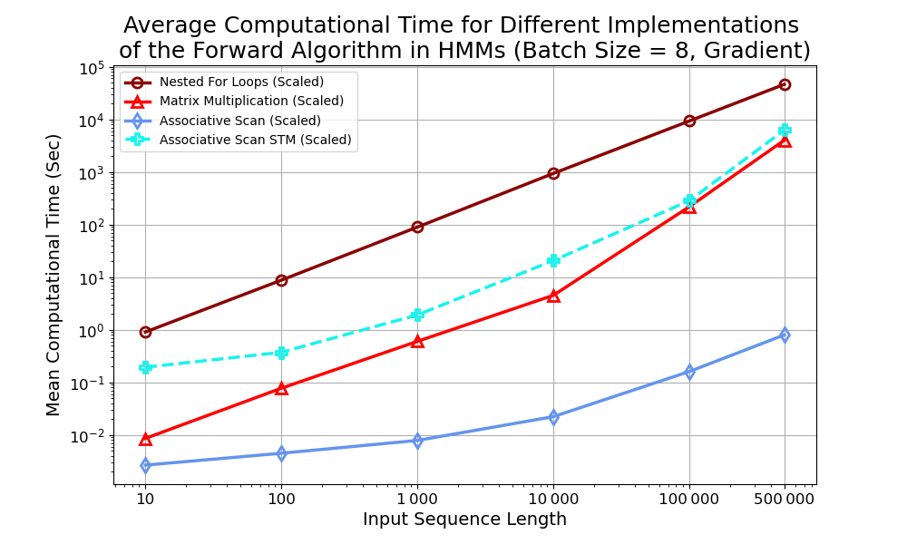
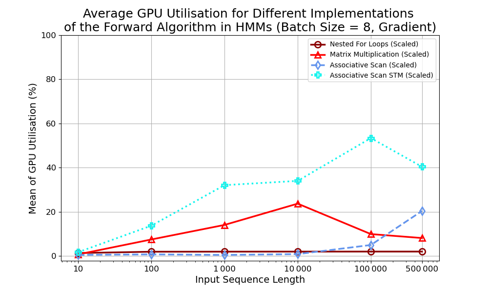
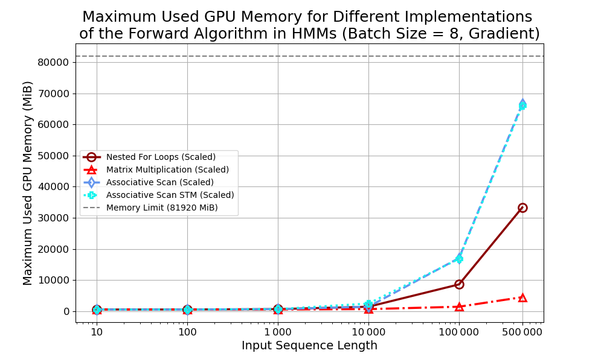

# Interpreting the Connectionist Temporal Classification Loss as the Likelihood of a Hidden Markov Model and Benchmarking Parallel Implementations that Use TensorFlow

This repository contains the code for my Master's thesis, focused on efficient GPU-accelerated implementations of probabilistic sequence models (HMM, pHMM, CTC).
The goal is to optimize runtime and resource usage while enabling scalable analysis of sequencing data.

### Requirements

This project requires Python 3.10.12 and the packages listed in `requirements.txt`. Install them with:

```bash
pip install -r requirements.txt
``` 


### Repository Structure

The work is organized into the following directories:

- [benchmark_HMMs](benchmark_HMMs) – Implementation and evaluation of classical Hidden Markov Models (HMMs) used in genome annotation. Different computational strategies are compared to optimize runtime and GPU resource usage.
- [pHMM](pHMM) - Parallelized implementation of Profile Hidden Markov Models (pHMMs).
- [CTC_CRF](CTC_CRF) – Development of a method for efficient computation of the Connectionist Temporal Classification (CTC) loss based on a probabilistic model. 

Each directory contains the code and results related to a specific part of the thesis.


### Documentation (`/docs`)

The `/docs` directory contains supplementary materials for this repository:

-  [Abstract (PDF)](docs/abstract.pdf)
-  [Mathematical Background and Algorithm Descriptions](docs/mathematical_background_and_algorithm_description/)

These documents provide deeper insight into the theoretical and technical foundations of the project.

<br>

### HMM Benchmark Results (Example Results)

The following plots show the performance of different implementations of classical Hidden Markov Models (HMMs) used in genome annotation.  
They compare runtime, GPU utilization, and GPU memory usage for the evaluated approaches.

<table>
  <tr>
    <td>
      
      <p align="center">Average Computational Time for different HMM implementations</p>
    </td>
    <td>
      
      <p align="center">GPU utilization for different HMM implementations</p>
    </td>
  </tr>
  <tr>
    <td colspan="2" align="center">
      
      <p align="center">GPU Memory usage comparison for different HMM implementations</p>
    </td>
  </tr>
</table>

<br> 
