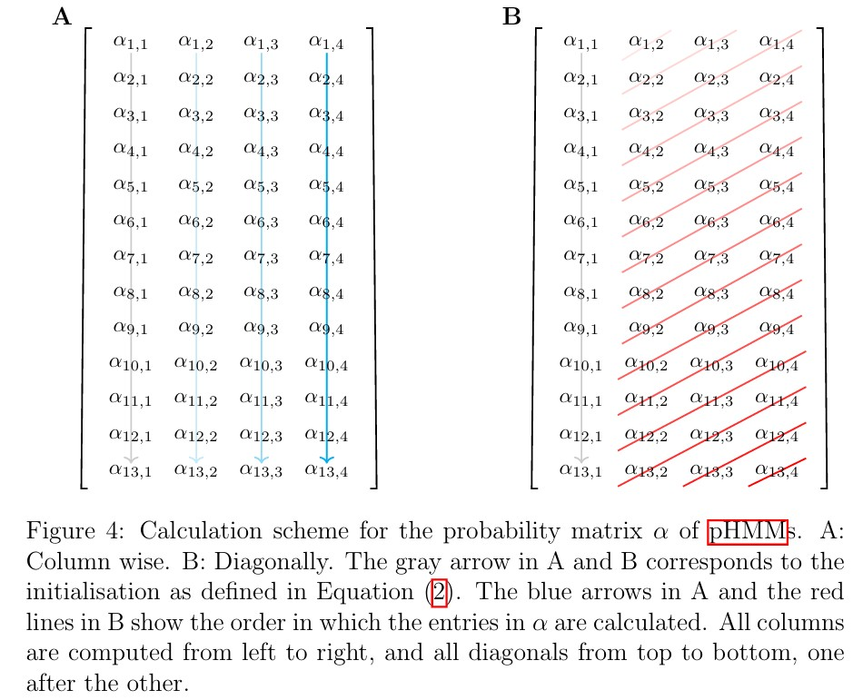

<br> <br>


## Profile HMMs

A **profile Hidden Markov Model (pHMM)** is an extension of the standard Hidden Markov Model (HMM), commonly used in bioinformatics and sequence analysis. Like a traditional HMM, a pHMM includes:

- A set of hidden states  
- A transition matrix  
- An emission matrix  
- An initial state distribution

However, pHMMs distinguish themselves by structuring their state space into **three specific types of states**:

- **Match states**  
- **Insert states**  
- **Delete states**

The total number of states \(K\) in a pHMM depends on the length \(L\) of the observed sequence and is given by:  
```math
K = 3 \cdot L + 1
```

## Duration Array and State Behavior

A binary duration array `d ∈ {0, 1}^{1 × K}` is introduced to indicate whether an observation at time step `t` is considered in a given state:

- `d(q) = 1` for match and insert states (observation is consumed)
- `d(q) = 0` for delete states (observation is skipped)

This allows for the modeling of gaps or deletions in sequence alignment, a key application area of pHMMs.

## 📈 Forward Algorithm for pHMMs

The forward algorithm is adapted accordingly, where the forward variables `α_t(q)` are computed using:

```math
\alpha_t(q) = \left( \sum_{q'=1}^{K} \alpha_{t - d(q)}(q') \cdot a_{q'q} \right) \cdot b_{q, u_t}
```

Here:

-  `a_{q'q}`: transition probability from state `q'` to `q`  
- `b_{q, u_t}`: emission probability of observing `u_t` in state `q`

Special attention is required when `d(q) = 0`, since no observation is consumed, and the model advances in state but not in time. This models the *delete states*, where only the internal model structure progresses.

To ensure well-defined recursion in such cases, transitions must respect a strict ordering: `q' < q`, avoiding circular dependencies.


##  References
- Eddy, S.R. — pHMMs in bioinformatics  
- Rabiner, L. — HMM theory and applications


### Parallel Computation of the Forward Probabilities in pHMMs

Normally, the entries of the forward probability matrix α are calculated column by column as shown in Figure 4A.  
However, it is not possible to calculate an entire column in one step.  
More precisely, computing an entry of α associated with a delete state q_d in column t requires values from the same column. This is because d(q_d) = 0 and therefore, α_{t - d(q)} = α_t. Using this procedure, no parallelisation across states is possible.

This problem can be avoided by calculating the entries in α along diagonals, which is illustrated in Figure 4B.  
This allows the calculation of an entire diagonal in parallel, which is supposed to reduce the computational time for the computation of α.  
Nevertheless, the diagonals are still calculated one after another rather than all at once.





### Implementations of pHMMs

Three implementations of probabilistic Hidden Markov Models (pHMMs) are compared below.  
All versions compute the forward probability matrix **α** using the same equations for initialization and recursion.  
The only differences lie in the **order of computation** and whether the execution is **sequential** or **parallelised**.

---

#### 1. Column Wise Loops

The entries in **α** are computed **column by column**, and within each column, entries are calculated **sequentially**.  
This implementation contains multiple `for` loops (over time steps **t** and states **q**) in Python and is therefore referred to as **Column Wise Loops**.

---

#### 2. Diagonal Loops

In this version, entries of **α** are computed **diagonally**, as illustrated in the diagram (*pHMM matrices B*).  
Each diagonal is processed **one after another**, and within each diagonal, the entries are computed **sequentially**.  
This version is called **Diagonal Loops**.

---

#### 3. Diagonal Parallelised

Similar to *Diagonal Loops*, this implementation processes **α** along diagonals, but **computes all entries of a diagonal in parallel**.  
Diagonals are still processed one after the other.  
This version uses **sparse representations** of the transition matrix **A** to optimise memory usage and performance.  
It is referred to as **Diagonal Parallelised**.

